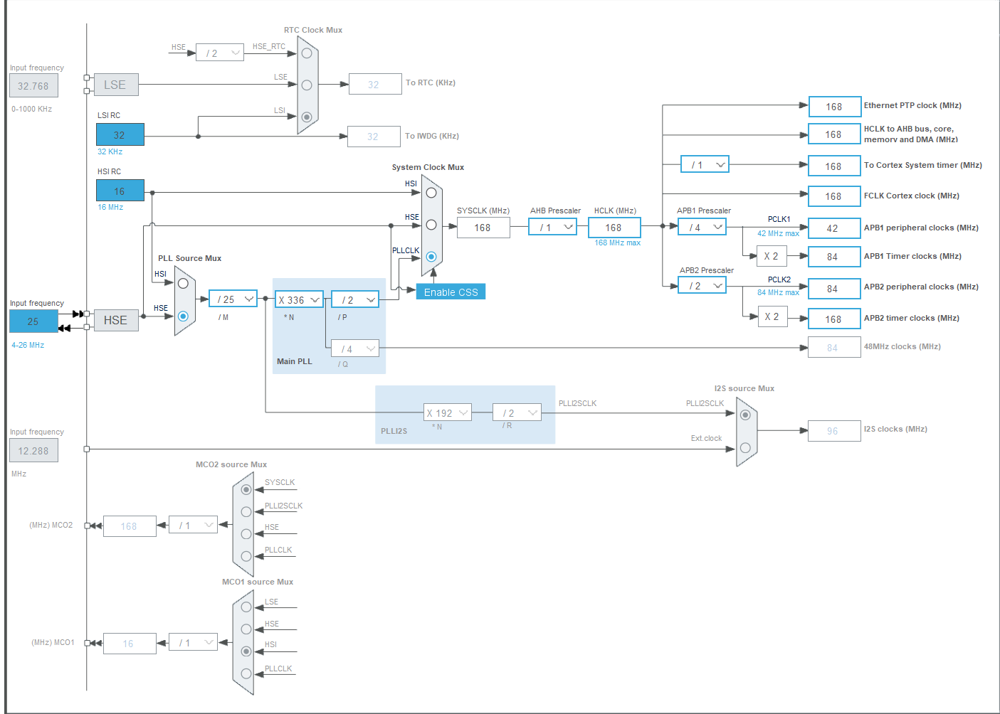
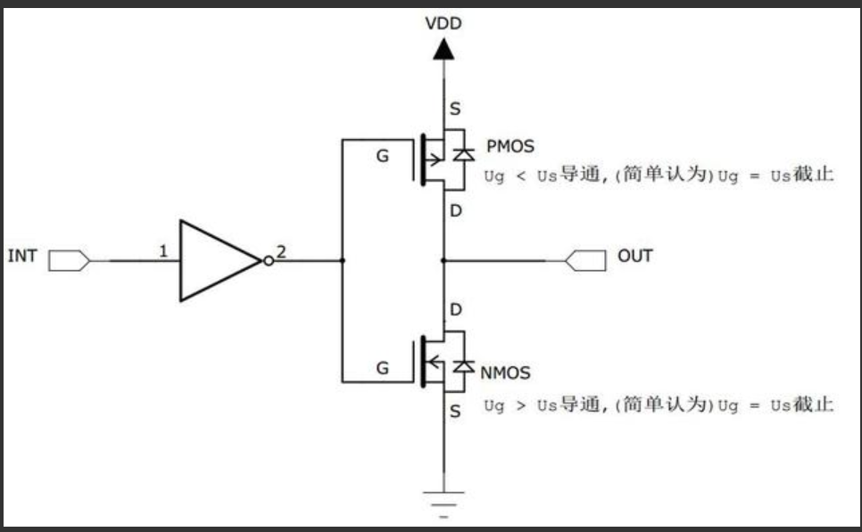
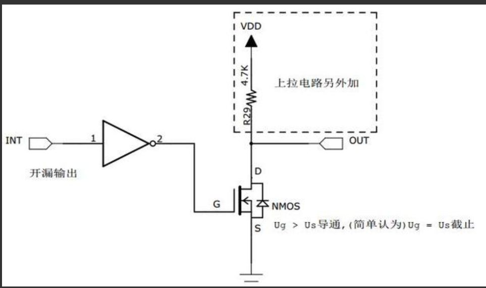
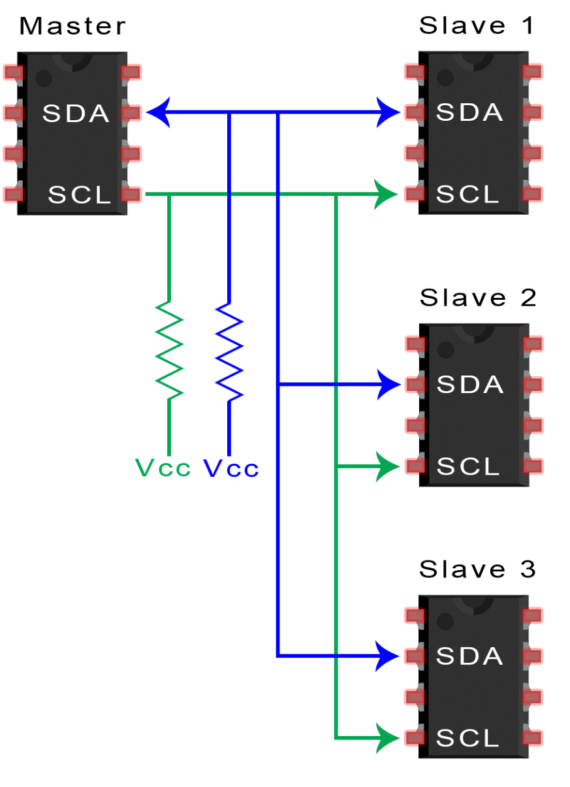
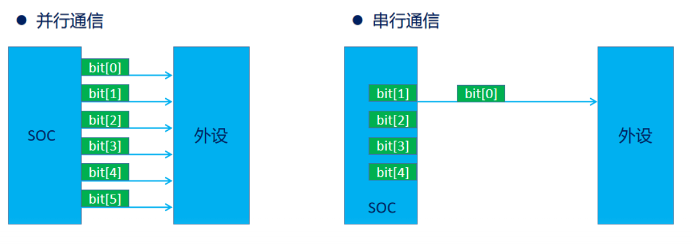
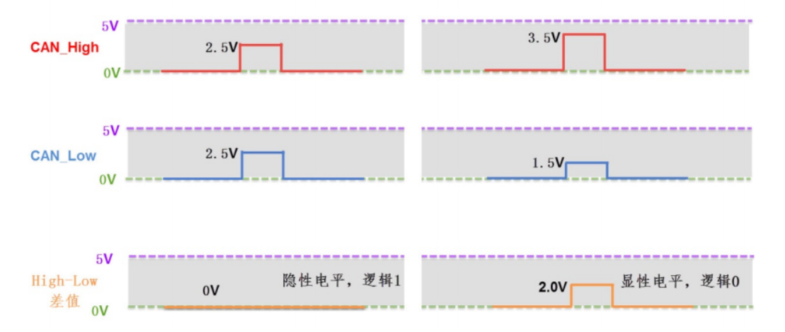
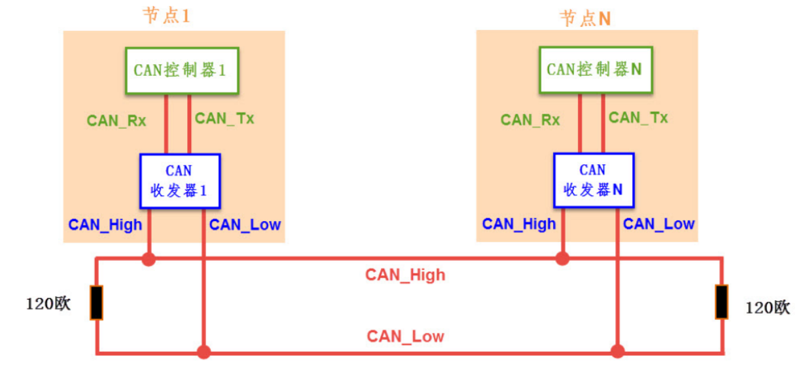
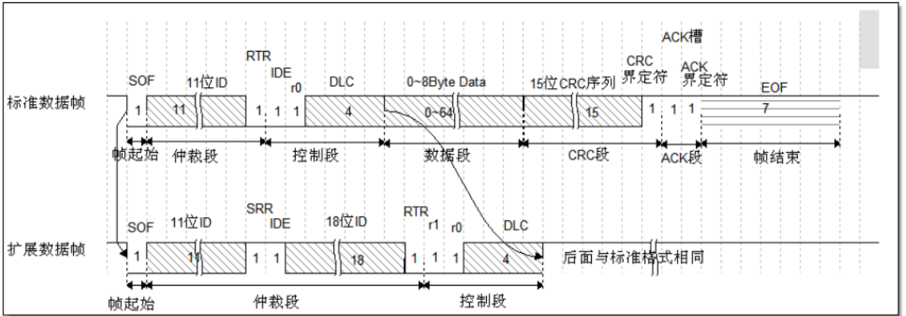
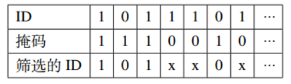

<!--
 * @Author: Frt001 2067314783@qq.com
 * @Date: 2026-08-07 19:49:18
 * @LastEditors: Frt001 2067314783@qq.com
 * @LastEditTime: 2026-08-10 18:55:21
 * @FilePath: \f4\f4_cubemx配置.md
 * @Description: 这是默认设置,请设置`customMade`, 打开koroFileHeader查看配置 进行设置: https://github.com/OBKoro1/koro1FileHeader/wiki/%E9%85%8D%E7%BD%AE
-->

# STM32F405RGT6

可以多了解些硬件底层内容

## 一、时钟配置
SYS 时钟源用TIM1  
RCC HSE用外部晶振  
时钟配置，拉高频率跑满芯片性能  
外频用HSE，先降频到1-2MHz，之后再升频到168MHz，先降频是为了进PLL锁相环，之后再升频是为了让芯片跑满性能。  
AHB（高速总线）：配置为 /1。内存、DMA 和 CPU 核心一样硬核，直接享受 168MHz 满速待遇。  
APB1（低速外设总线）：物理极限是 42MHz。所以必须配置为 /4（168 / 4 = 42MHz），一点没浪费。
APB2（高速外设总线）：物理极限是 84MHz。所以配置为 /2（168 / 2 = 84MHz），同样顶格拉满。  
给定时器开了“后门”，让最高级的定时器（如 TIM1/TIM8，挂在 APB2 上）依然能以 168MHz 的满血速度运行  
Project Manager 调堆栈，勾选Generate peripheral initialization as a pair of '.c/.h' files，生成.c和.h文件，方便后续使用。  




## 二、GPIO
### 1. GPIO输出
#### cubemx配置  
看原理图  
output level:MX_GPIO_Init()执行完成后，引脚的默认输出电平高低  
mode:输出模式 推挽和开漏  
推挽：内部信号直接驱动输出端口，输出高电平时，内部信号给高，NMOS截至，PMOS导通，对外输出高电平；输出低电平时，内部信号给低，NMOS导通，PMOS截至，对外输出低电平。  
既具有高电平驱动能力，又具有低电平驱动能力。MOS管的导通电阻很小，输出端口的驱动能力很强，MOS“推”上去的，会比较快。  
  
开漏：上方没有PMOS，输出低电平时和推挽类似，NMOS导通，引脚被下拉到低电平；输出高电平时NMOS截至，但是上方也没有PMOS，所以引脚现在的状态是浮空的，外部需要上拉电阻将引脚拉高。 

  
具有低电平驱动能力，不直接具有高电平驱动能力，只能接地，拉完了，但是有一些场景需要开漏输出，“线与”特性与多机并联I2C总线：SDA数据线，SCL时钟线，Master 想要发数据 1：它内部的 PMOS 强力导通，把蓝色的 SDA 整根线强行拉到 Vcc，Slave 1 此时刚好想要回一个 0：它内部的 NMOS 强力导通，把同一根蓝色的 SDA 线强行拉到 GND（0V），结果：Master的VCC和Slave 1的GND相连，短路了，通信瘫痪、引脚烧毁。I2C用开漏输出是怎么解决这个问题的：（自己查）“线与特性”；输出5V。 
  
PULL UP/PULL DOWN：芯片内部上拉/下拉电阻，给引脚一个默认电平，避免引脚悬空，与前面的推挽输出/开漏输出属于“并联”关系，相当于在引脚上除了输出电路再挂载一个默认的电阻，在输出电路初始化前或者是输出电路浮空时给引脚一个默认的电平，引脚浮空：很容易受外部电磁扰动，可能会产生不好的影响要尽量避免浮空状态存在，在输入部分还会提，影响会更大一些。  
output speed:输出速度，影响输出端口的上升沿和下降沿的速度，速度越快，电流越大，功耗越大，对于灯、蜂鸣器这种设备，速度不需要太快，选择低速即可；对于通信接口，速度如果太慢可能会导致波形边缘失真，严重点会导致通信乱码，盲目的给高速也可能会因为电流过大，产生高频电磁干扰，也会产生一些不好的影响。  
User Label：取名字，给这个引脚取个别名，取好名字后会在main.h中生成对应的宏定义，方便后续使用。
``` C
#define LED1_Pin GPIO_PIN_4
#define LED1_GPIO_Port GPIOA
#define LED2_Pin GPIO_PIN_5
#define LED2_GPIO_Port GPIOA
```h723zet6


#### HAL库函数
write_pin：写引脚电平  
toggle_pin：翻转引脚电平  
  
Port（端口）和Pin（引脚）：一个 Port 通常包含 16个 物理引脚。这 16 个引脚在单片机内部共享着同一套时钟线、电源基准，以及一组连续的硬件控制寄存器，16个引脚对应寄存器的低16位。通常不同端口、不同引脚号对应的该引脚的功能会有些许不同，A一般功能会比B多一些，也有可能有些功能是B有而A没有的。具体要看芯片的手册上对功能的描述。除了一些专有引脚，大部分引脚做GPIO输入输出都是没问题的。硬件组在画板子的时候一般也会考虑到引脚的功能，选择对应的引脚，参考原理图上对应引脚的设置就可以  

流水灯、蜂鸣器  

``` C
HAL_GPIO_WritePin(GPIOA, GPIO_Pin_1, GPIO_PIN_SET)
HAL_GPIO_WritePin(LED2_GPIO_Port, LED2_Pin, GPIO_PIN_RESET)
HAL_GPIO_TogglePin(GPIOD, GPIO_Pin_4)
```

### 2. GPIO输入
#### cubemx配置
依旧看原理图，U3做输入，没有预留的GPIO输入口，找个串口魔改一下，既有vcc又有gnd，一个串口两个引脚TX RX都可以改成GPIO输入用来外部信号的输入。  
引脚配置成GPIO_EXTI，EXTI是外部中断，这个模式是包含了GPIO_Input的全部功能，但是比输入又多了一个和NVIC（中断控制器）相关的功能，GPIO_Input模式只是单纯的输入功能，GPIO_EXTI模式是输入功能+中断功能。  
中断的理解：自学。  
简化版：条件触发，CPU保护程序运行现场，程序被打断，程序跳转到中断服务函数，执行完毕后返回原来程序运行现场继续执行。  
External Interrupt Mode：外部中断模式，符合条件时会触发中断。  
External Event Mode：外部事件模式，和中断模式类似，但是没有中断功能，只有事件功能，事件：条件触发，直接调用另一个外设，不过cpu，也不打断程序运行。  
条件：上升沿、下降沿、上升+下降  
Pull up/Pull down: 依旧默认下拉还是上拉，浮空状态引脚易受外部电磁扰动，可能会误触发中断。  
  
#### HAL库函数
read_pin：读引脚电平

``` C
pin_state = HAL_GPIO_ReadPin(GPIOE, OpticalSide0_Pin);
```  
轮询读取，单线程：实时性就没法看；多线程：占一个任务，而且效率也不高。  

外部中断：  
中断向量表跳转至对应handler -> HAL_GPIO_EXTI_IRQHandler(uint16_t GPIO_Pin)  
IRQ(Interrupt Request中断请求)  
HAL_GPIO_EXTI_Callback(uint16_t GPIO_Pin)  

中断加读取检查：上升下降均触发，触发后readpin确定触发状态，中断回调函数内部只做信息处理，不能放任何延时，包括任何等待类似于while(.....)，定义变量时加volatile，禁止使用动态分配内存malloc。

## 三、定时器

最基础的定时器功能：计数，计数到指定值后触发中断，回调函数里做一些事情。  
#### cubemx配置

TIM2时钟源：Internal Clock，内部时钟源，芯片内部的时钟线直接给定时器供时钟。  
PSC（Prescaler，预分频器）：定时器的计数速度 = 定时器时钟 / (PSC + 1)，PSC越大，计数速度越慢。  
计数模式：向上计数，计数器从0开始计数，计数到ARR（Auto Reload Register，自动重装载寄存器）指定的值后触发中断，计数器清零重新开始计数。  
ARR：计数器计数到ARR指定的值后溢出，计数器清零重新开始计数。
内部时钟分频：不用管，一般做滤波电路会用到  
自动重装预加载：代码里改ARR，可以暂存到当前数完，就不会发生溢出错乱。（从1000->500）但是定时器数到了600了已经。  
主从同步模式：不用开，各个定时器直接不用联动  
定时器计数溢出事件计算公式：(PSC+1)*(ARR+1)/fclk  
预分频系数+1是为了避免没设置预分频从0开始的情况，ARR+1是因为计数器从0开始计数，fclk是定时器时钟频率。TIM2时钟源是APB1，APB1分频是4，TIM2时钟源 = 168MHz / 4 *2= 84MHz。
开中断  


#### 中断函数
初始化

``` C
	if(HAL_TIM_Base_Start_IT(&htim2) != HAL_OK)
	{
        Error_Handler();
    }
```

HAL_TIM_PeriodElapsedCallback，对cubemx的妥协，因为把 TIM1 设为了 HAL 库的系统心跳，CubeMX 会为了保证系统能跑，自动在 main.c里面写死了一个没有 __weak 的强回调函数：

#### PWM

pwm的概念：脉冲宽度调制：单片机的引脚输出只有两个状态，高电平（3.3v）和低电平，pwm就是通过改变高电平和低电平的时间比例来模拟出一个连续变化的模拟量。比如：一秒钟内高电平持续 0.5 秒，低电平持续 0.5 秒，高低电平是不断交替变化的，那么这个 pwm 的占空比就是 50%，输出给一个led灯就会给人一种“半亮”的感觉，如果高电平持续 0.8 秒，低电平持续 0.2 秒，那么这个 pwm 的占空比就是 80%。
占空比：高电平持续时间  
PA6 PA7 TIM3_CH1 TIM3_CH2  
开自动重装预加载  
MODE 1:只要计数值 CNT 小于 你设定的 CCR（比较寄存器） 值，引脚就输出“有效电平”；大于等于 CCR 时，输出“无效电平”。  
2反着来  
Pulse 初始CCR值，初始占空比  
Output compare preload —— 占空比修改防撕裂，跟重装预加载类似，也是为了避免占空比修改时，计数器还没数完就溢出了，导致占空比错乱。  
CH Polarity：引脚极性，给高就是这个引脚输出高电平，给低就是这个引脚输出低电平。  

```C
HAL_TIM_PWM_Start(&htim3, TIM_CHANNEL_1);  
__HAL_TIM_SET_COMPARE(&htim3, TIM_CHANNEL_1, 500);  
```
呼吸灯  

作业
可用的外设：GPIO输入（一个按键）中断触发以及readpin读电平状态、GPIO输出（LED1-4、beep）、定时器中断、定时器pwm呼吸灯（LED3-4）;  
复现所有内容


## 四、串口（UART）
#### 串行通信
串行通信：数据是排着队，一个 bit 接着一个 bit，在同一根信号线上依次发出去的（USB、RS232、RS485、CAN、I2C、SPI、UART等），速度慢，成本低，线少，传输距离比较短，抗干扰能力不强  
并行通信：几根线并排，同时传送多个bit数据，速度快，但是成本高，线多，也容易干扰，要保证各条线之间的时序和电气特性一致。  
关于串行、并行、差分、单端、全双工、半双工、同步、异步，详细内容自行查阅资料了解  
  
  
UART ：只需要两根线（TX和RX）即可完成数据传输，但是实际接线还要有GND VCC，单端通信，每根线单独传递信息，例如：A的RX断掉了，TX还是可以接着发数据，B也一样可以收到正确的数据，只不过A收不到B发的数据。缺点就是很容易干扰  
#### cubemx配置
Asynchronous（异步模式）两线，一根TX，一根RX，通信双方约定好通信速率、数据位、校验位、停止位等参数，通信双方各发各的，即UART。  
Single Wire (Half-Duplex)（单线半双工模式）  
Synchronous（同步模式），比异步模式多一根时钟线，即USART，类似于阉割过的SPI通信，不如直接用SPI，虽然硬件支持但是一般不用这个模式。    

波特率：每秒钟传输的二进制比特（bit）数，115200是对于普通的芯片、线材来讲比较稳妥且快速的一个波特率，太高了可能会因为芯片、线材、干扰等原因导致通信不稳定。为什么是115200：旧时代的遗留物，老式串行通信一般1200 2400，后面为了保持向下兼容就继续采用了1200的倍数  

字长：一个字节的大小、8位  
校验位：无校验  
停止位：1位

虽然是1位1位发，但是发送的时候会做一个小小的打包，一个字节后加上一个停止位或者再加上校验位，接收端就可以根据停止位和校验位把每个字节拼好
大数据包：包头包尾

过采样：对于115200波特率，每个bit的时间是8.68us，过采样就是在这个时间内采样多次，取多数值作为最终结果，过采样越高，抗干扰能力越强，但是通信速率会降低。

RX给个上拉，TX不用管  
NVIC开中断。  

#### 收消息  

三种：
1. 阻塞接收 HAL_UART_Receive()；拉完了，死等，整个程序都等着收消息。知道就行。  
2. 定长中断接收 HAL_UART_Receive_IT()；触发RXNE（接受寄存器非空）中断，提前知道要收几个字节的情况下，可以做到收够这几个字节后触发中断，但如果不知道消息多长，就只能一个字节触发一次，自己去处理。  
3. 空闲中断接收 HAL_UARTEx_ReceiveToIdle_IT()：触发IDLE（空闲）中断，空闲中断：接收寄存器空了一段时间后，意味着数据传输结束，触发中断，很方便的硬件机制，可以处理数据消息不定长的情况。  

##### 定长中断接收
``` C
    HAL_UART_Receive_IT(&huart1, rx_buffer, 5);//初始化后启动第一次接收
    void HAL_UART_RxCpltCallback(UART_HandleTypeDef *huart)//中断回调 

    if (huart->Instance == USART1) 
    {
        // 校验一下包头是不是正确的
        if(rx_buffer[0] == 0xAA) {
            // 解析数据...
        }
        
        // 重启接收
        HAL_UART_Receive_IT(&huart1, rx_buffer, 5);
    }
```
数据包里几个1就响几声蜂鸣  

##### 空闲中断接收
``` C
    HAL_UARTEx_ReceiveToIdle_IT(&huart1, rx_buffer, sizeof(rx_buffer));//初始化后启动第一次接收
    
    void HAL_UARTEx_RxEventCallback(UART_HandleTypeDef *huart, uint16_t Size)//中断回调 

    if (huart->Instance == USART1) 
    {
        // 校验一下包头是不是正确的
        if(rx_buffer[0] == 0xAA) {
            // 解析数据...
            
        }
        
        // 重启接收
        HAL_UARTEx_ReceiveToIdle_IT(&huart1, rx_buffer, sizeof(rx_buffer));
    }
```

#### 发送消息
``` C
    HAL_UART_Transmit(&huart1, tx_buffer, sizeof(tx_buffer), HAL_MAX_DELAY);//阻塞式发送死等消息发完，最后一位是超时时间，一个字节理论耗时0.086ms，留出3-5倍的余量  

    HAL_UART_Transmit_IT(&huart1, tx_data, len);//中断发送，cpu消耗依旧很大，每发一个字节cpu触发一次中断，处理完后继续发下一个字节，效率不高，比不上dma也没比阻塞强多少  
```


#### DMA
dma在串口接收的应用，数据搬运不过cpu，给cpu减负，同时可以
关于dma的介绍：https://blog.csdn.net/as480133937/article/details/104927922

#### 收消息

##### 定长dma接收
```C
    HAL_UART_Receive_DMA(&huart1, rx_buffer, 5);//初始化后启动第一次接收
    void HAL_UART_RxCpltCallback(UART_HandleTypeDef *huart)//中断回调 

    if (huart->Instance == USART1) 
    {
        // 校验一下包头是不是正确的
        if(rx_buffer[0] == 0xAA) {
            // 解析数据...
        }
        
        // 重启接收
        HAL_UART_Receive_DMA(&huart1, rx_buffer, 5);
    }
```  

##### 空闲中断dma接收
```C
    HAL_UARTEx_ReceiveToIdle_DMA(&huart1, rx_buffer, sizeof(rx_buffer));//初始化后启动第一次接收
    
    void HAL_UARTEx_RxEventCallback(UART_HandleTypeDef *huart, uint16_t Size)//中断回调 

    if (huart->Instance == USART1) 
    {
        // 校验一下包头是不是正确的
        if(rx_buffer[0] == 0xAA) {
            // 解析数据...
            
        }
        
        // 重启接收
        HAL_UARTEx_ReceiveToIdle_DMA(&huart1, rx_buffer, sizeof(rx_buffer));
    }
```  
从使用上来说，空闲中断dma接收是最方便的，数据包不定长，cpu负担小，效率高。  
基本上可以无脑用dma接收，但是it会更简单一些，dma出问题it也要会。  
进阶使用，空闲中断+dma的循环模式+环形队列（软件层，收不定长消息，鲁棒性强），双缓存区dma（硬件层，0丢包、0错位）

发送消息
``` C
    HAL_UART_Transmit_DMA(&huart1, tx_buffer, sizeof(tx_buffer));//dma发送，cpu消耗很小，数据搬运不过cpu，给cpu减负，但是cpu比dma快，存在一种情况，cpu处理完了，dma还没搬运完，cpu就继续更新下一个数据包，导致数据包错位，解决办法：1.加延时 2.用双缓存区dma 3.用环形队列（软件层）
```

## 五、CAN

### CAN通信
有关can通信的硬件介绍参考https://blog.csdn.net/XiaoXiaoPengBo/article/details/116206252
#### 物理层
差分异步通信，两根线，CAN_H和CAN_L  

总线结构（一个总线上可以有多个节点交互）不是点对点，闭环网络，总线两端各有一个120欧姆的终端电阻（类似吸音棉，信号走到总线末端时会被电阻吸收，不会产生回波干扰总线信号），120欧正好和双绞线阻抗匹配，保证总线信号完整性，防止信号反射。电阻本身可以帮助电容放电，可以加速电平复位。  
  
#### 协议层  
异步通信，两根线没有时钟线同步，需要约定好波特率（1Mbps，闭环总线能跑到的最高波特率）  
两根线没压差（都是2.5V）代表逻辑 1（实际消息代表1），两根线有压差（CAN_H拉高，CAN_L拉低）代表逻辑 0（实际消息也代表0），和UART串口通信正好相反，CAN总线具有“线与”特性，多个节点同时发数据时，显性电平占优，最终总线状态是有压差的，意味着发出去的这一位是0。  
不同于UART点对点的简单封装，CAN总线通信包含一个复杂的协议，CAN总线上发的每一帧消息称为报文，CAN一共规定了五种类型帧（数据、遥控、过载、错误、帧间隔），每一条报文都满足一个特定的结构，常用数据帧，包含的信息最多，结构最复杂，简单来看包含：起始位，id，数据长度，数据，校验，结束位等，id是CAN总线的核心，id越小优先级越高，id相同的报文会产生冲突。  
冲突问题：两根差分线异步通信还是总线结构，UART是用一根线去发送数据，两根线互不影响，通信双方自己发自己的，自己收自己的不会冲突，但是can总线就两根线，挂载了多个节点（通信方），每个节点都可以发数据，而且每一条报文都会占用两根差分线，就会存在一个问题，多条报文同时发送到总线上时，就面临着冲突。CAN总线解决这个冲突利用的就是“线与”特性，每个节点在发送消息的时候同时会监听总线上的消息，因为总线上如果同时即有人发0，又有人发1，总线最终呈现为0，发送1的节点会发现总线上的和自己发送的不一样，就会停止发送，进入接收状态，等待这条报文发送完成后再重新发送，0001 > 0010(id越小优先级越高)标准帧>扩展帧，错误帧：当仲裁段过了后发现总线上的消息和自己发送的不一样，就会发送错误帧，告诉总线上的其他节点，这条报文有问题，其他节点收到错误帧后会丢弃这条报文，等待下一条报文。  
数据段只有八个字节，这一点不像UART一样想发多长的消息发多大，如果消息超过八个字节，就需要拆分成多条报文发送，接收端收到多条报文后再拼接成完整的消息，但是8个字节能存的东西也还是不少的。  
  

#### stm32的can控制器自己了解

#### cubemx配置

分频系数：3 APB1有42MHz，42/3=14MHz  
tq（时间片）=1/14MHz=71.4ns，是CAN底层的最小不可再分时间，
BS1 = 9 BS2 = 4 SYNC_SEG（在两段前）占1个tq，bit time(实际一个bit发送所用时间) = (1+9+4)*tq = 14*tq = 1us，bit rate = 1/bit time = 1Mbps，每个bit在发送的时候会被拆分成14个时间片，其中stm32会在BS1和BS2的交界处(一般为整个周期的70%-80%)读电平，这时读的电平是最准的，前面读的电平可能还没稳定，后面读的电平可能已经被下一个bit影响了。  
SJW：如果两个节点的时钟不是同步的话，把某个bit拉长或缩短一点点，保证两个节点的时钟同步，避免通信出错，这一点点的大小就是SJW，一般给1个tq就够了。

TTCM：时间触发通信模式，开启后每条CAN报文会加上一个时间戳，一般航空航天这种级别才需要这种同步，平时不用开。  
ABOM：自动离线管理，要开，CAN芯片内部的计数器会记录错误次数，错误次数超过一定值后会自动进入离线状态，离线状态下不会再发送报文，避免总线被占用，影响其他节点通信，总线干扰比较大的情况开启后可以及时自动连接。  
AWUM：为汽车设计的，单片机有休眠模式，开启后总线来消息后会自动唤醒单片机，我们的单片机会始终满载运行，开不开没区别。  
ART：自动重传，要开，跟前面提到的冲突问题有关系，当仲裁失败或者是发送错误帧后，CAN控制器会自动重发这条报文，避免丢包。  
RFLM：stm32的每个FIFO有三个信箱，当三个信箱满了后来了第四帧消息，默认处理是丢弃掉最旧那条消息，开启后如果消息没被搬出去就也不会收新消息，我们不开，因为我们要保证每时每刻我读到的电机消息都是最新状态。  
TXFP：发送优先级，发送FIFO里三个信箱塞了三条消息时，默认是按id比较优先级，开启后会按照时间顺序，谁先塞进来的谁先发送，不用开，CAN总线的仲裁机制已经很优秀了  

MODE：正常模式，收发都可以，回环模式，收发都可以，但是发送的消息会被自己收到，方便调试，静默模式，只能接收不能发送，方便调试，静默回环模式，回环模式下同时保持静默，一般用于及其恶劣或未知的外部硬件环境进行调试，确保不存在干扰。  
开NVIC，

#### HAL库函数

FIFO(First In First Out)先进先出，消息队列，每个CAN控制器有两个独立的FIFO，FIFO0和FIFO1，相当于有两个队可以排队，FIFO0和FIFO1各有三个信箱，每个队最多排三个消息。  

筛选器（过滤器）:CAN总线上多个节点都可以向总线上发送消息，但是对于一个节点来说，不一定需要收线上的所有消息，可能只会针对性的收某几个节点的消息，CAN控制器内部有一个硬件筛选器（过滤器），可以根据id来筛选消息，只有符合条件的消息才会被搬到FIFO里，其他的消息会被丢弃掉。
F4一共提供了28个过滤器，但是CAN1比CAN2在硬件设计上要地位高一些，28个过滤器和FIFO收发的专用SRAM都是CAN1独占的，CAN2能用到多少资源取决于配置过滤器时CAN1分给他多少，还有一个问题就是如果不配CAN1，直接配置CAN2是用不了的，CAN1的时钟线不开，CAN2也用不了  
每个筛选器组有两个32位宽的寄存器（FR1 FR2）（存放过滤规则），当使用16位位宽的时候，把两个寄存器都从中间一分为二，每个寄存器的高位和低位各自就变成了一个16位宽的寄存器，当使用32位位宽时，FilterIdLow和FilterIdHigh拼起来是整个FR1的32位，FilterMaskIdLow和FilterMaskIdHigh拼起来是整个FR2的32位。什么情况用32：扩展帧，扩展帧一帧id29位加上后面的RTR和IDE位，16位宽根本放不下，只能用32位宽。但如果是标准帧：用16更好，标准帧id11位加上后面的RTR和IDE位，16位宽足够了，而且如果用16位位宽相当于有四个寄存器可以用，可编辑的过滤器更多，灵活性也更高。  
列表/掩码（不同的过滤方式）：  
32位列表模式：两个独立的寄存器，每个寄存器存一个id，id匹配就收，id不匹配就丢弃。写代码的时候要做一个位运算，分别存储高16位和低16位。
32位掩码模式：FR1存基准id，FR2存掩码id，掩码id的每一位是0或1，0表示不管这一位是0还是1都收，1表示这一位必须和基准id一样才收。写代码的时候同样要做一个位运算，分别存储高16位和低16位。很适用于收一类id的消息。
16位列表模式：四个独立的寄存器，每个寄存器存一个id，id匹配就收，id不匹配就丢弃。  
16位掩码模式：（可以配两类id）FilterIdLow存基准id1，FilterMaskIdLow存掩码 1，这两个作位运算作为一类id的过滤器，FilterIdHigh存基准id2，FilterMaskIdHigh存掩码 2，这两个作位运算作为另一类id的过滤器。在过滤的时候，只要满足其中一条就可以收。  

stm32底层架构是小端序，低位是低0位。对于标准帧id：实际的id只占11位，16位寄存器里[15-5]位是给id存放留的位置，所以在往寄存器里存的时候要<<5，左移5位，实际写的时候(0x201 << 5)；对于扩展帧，实际的id只占29位，32位寄存器里[31-3]位是给id存放留的位置，所以在往寄存器里存的时候要<<3，左移3位，除此之外第[2]位是IDE位，用来标明这个id是标准帧id还是扩展帧id，直接左移后这一位是0，必须要把它置一，实际写的时候先拼出来这个32位((0x01010203 << 3) | 4)，在分别取低16位((0x01010203 << 3) | 4) & 0xFFFF和高16位((0x01010203 << 3) | 4)>>16，。  
标准帧的范围：0x000-0x7FF，扩展帧的范围：0x00000000-0x1FFFFFFF。




配过滤器  
``` C
//定义过滤器
    CAN_FilterTypeDef CAN_FilterConfig;
//一个过滤器
    CAN_FilterConfig.FilterActivation = ENABLE;                     // 激活过滤器
    CAN_FilterConfig.SlaveStartFilterBank = 14;                     // CAN1 CAN2的过滤器分割线，0-13给CAN1，14-27给CAN2
    CAN_FilterConfig.FilterBank = 0;                                // 使用第0个筛选器组
    CAN_FilterConfig.FilterScale = CAN_FILTERSCALE_16BIT;           // 位宽
    CAN_FilterConfig.FilterMode = CAN_FILTERMODE_IDLIST;            // 模式（列表/掩码）
    CAN_FilterConfig.FilterFIFOAssignment = CAN_FILTER_FIFO0;       // 用哪个FIFO的信箱
    CAN_FilterConfig.FilterIdHigh = (0x201 << 5);                   // 基准高位
    CAN_FilterConfig.FilterMaskIdHigh = (0x202 << 5);               // 掩码高位
    CAN_FilterConfig.FilterIdLow = (0x203 << 5);                    // 基准低位
    CAN_FilterConfig.FilterMaskIdLow = (0x204 << 5);                // 掩码低位
    if (HAL_CAN_ConfigFilter(&hcan1, &CAN_FilterConfig) != HAL_OK) { // 应用硬件中
        Error_Handler();
    }
//CAN启动以及启动两个FIFO的挂起中断

    if (HAL_CAN_Start(&hcan1) != HAL_OK)
        Error_Handler();
    if (HAL_CAN_ActivateNotification(&hcan1, CAN_IT_RX_FIFO0_MSG_PENDING) != HAL_OK) {
        Error_Handler();
    }
    if (HAL_CAN_ActivateNotification(&hcan1, CAN_IT_RX_FIFO1_MSG_PENDING) != HAL_OK) {
        Error_Handler();
    }
```
同样用中断来接收消息，每收到一条消息就触发一次中断，进中断回调函数处理信息，HAL库回调函数只区分FIFO0和FIFO1，不区分CAN1和CAN2，所以在回调函数里要判断是哪个CAN控制器触发的中断，不管是CAN1的FIFO0还是CAN2的FIFO0只要有消息就进FIFO0的回调函数。 

``` C
CAN_RxHeaderTypeDef RxHeader;
uint8_t RxData[8];

void HAL_CAN_RxFifo0MsgPendingCallback(CAN_HandleTypeDef *hcan)
{
    // 确保是 CAN1 触发的中断
    if (hcan->Instance == CAN1) 
    {
        // 从 FIFO 0 把数据捞出来，存到 RxData 数组里
        if (HAL_CAN_GetRxMessage(hcan, CAN_RX_FIFO0, &RxHeader, RxData) == HAL_OK)
        {
            if (RxHeader.StdId == 0x201) {
                
            }
            else if (RxHeader.StdId == 0x202) {
                // 这是 2 号电机发来的反馈...
            }
        }
    } else if (hcan->Instance == CAN2) 
    {
        
        if (HAL_CAN_GetRxMessage(hcan, CAN_RX_FIFO0, &RxHeader, RxData) == HAL_OK)
        {
            // 处理 CAN2 的消息...
        }
    }
}
```

发消息
``` C
    CAN_TxHeaderTypeDef TxHeader;
    uint32_t TxMailbox; // 用于记录这次发送用掉了哪个邮箱
    uint8_t TxData[8] = {0x01, 0x02, 0x03, 0x04, 0x05, 0x06, 0x07, 0x08}; // 要发送的数据

    TxHeader.StdId = 0x102;                 // 填入 11位 标准ID
    TxHeader.ExtId = 0;                     // 扩展ID
    TxHeader.IDE = CAN_ID_STD;//CAN_ID_EXT) // 标准帧
    TxHeader.RTR = CAN_RTR_DATA;            // 数据帧 
    TxHeader.DLC = 8;                  // 数据长度 (0~8)
    TxHeader.TransmitGlobalTime = DISABLE;  // 禁用时间戳

    HAL_CAN_AddTxMessage(&hcan1, &TxHeader, TxData, &TxMailbox);
```

